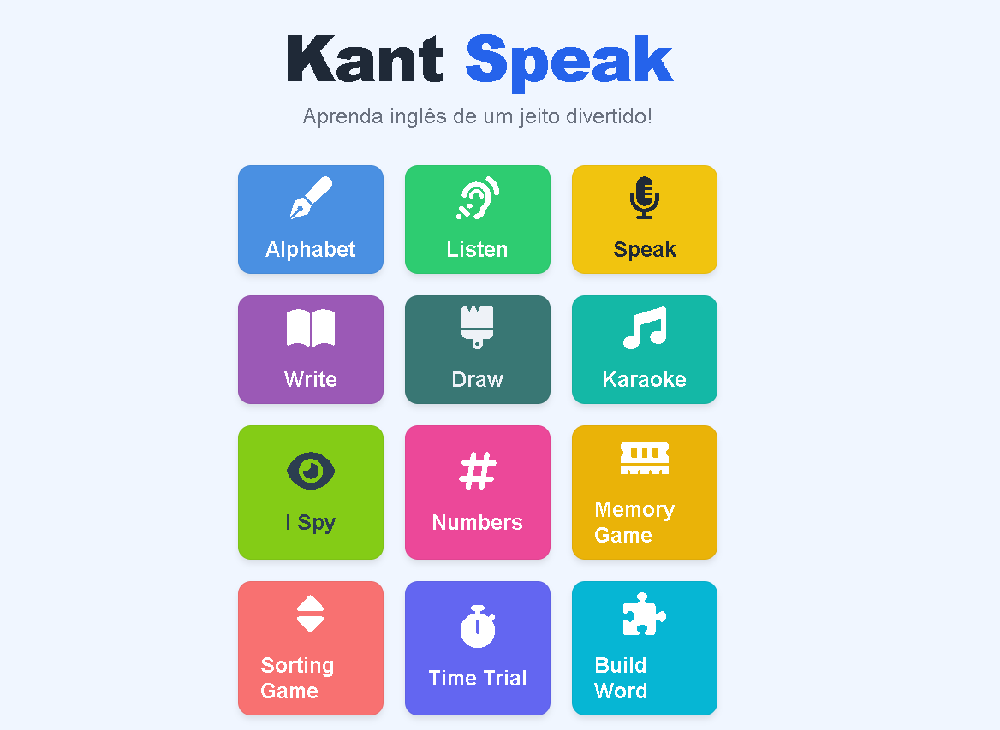

**\#  Summary**  
KantSpeak is an open-source web-based platform designed to support English language learning for children on the autism spectrum (ASD), particularly those classified within support levels 1 and 2\. The system provides interactive and multimodal activities that combine visual, auditory, and textual elements to facilitate engagement and comprehension.

The platform adopts a modular approach, allowing users to select different types of activities, including phonetic recognition, listening comprehension, and word association tasks. KantSpeak aims to reduce cognitive overload by offering a simple, predictable interface that supports autonomous interaction and structured learning experiences. Additionally, the system integrates a web-based Air Canvas interface that enables gesture-based interaction through browser-supported visual input mechanisms.

**\# Statement of need**  
   
According to data from the National Institute of Educational Studies and Research Anísio Teixeira, through the School Census, there has been continuous growth in the enrollment of special education students in regular classes in recent years, indicating an expansion of inclusion policies in the country.

Given this increase in autistic children with ASD in regular education, especially in public schools, it is necessary to increase the visibility of this population and promote strategies that ensure the quality of teaching and learning, keeping in mind the need to provide quality education.KantSpeak aims to be an educational tool for teaching the English language through interactive activities, based on the diversity of learning processes. It is based on the premise that there are different ways of assimilating content.

**\# State of the field** 

There are several digital tools designed to support language learning. One of the most widely used platforms is Duolingo, which offers structured activities aimed at teaching languages through repetition, gamification, and individualized progression.  
Despite its effectiveness in promoting engagement, such platforms are primarily designed for individual use and often emphasize standardized learning paths, with limited adaptation to specific educational contexts or diverse cognitive needs.

With a premise focused on inclusion in schools, the aim is to strengthen student performance through the development of projects focused on education. The system is designed to support different forms of content assimilation by providing a range of interactive activities that target multiple language skills, including phonetic recognition, listening comprehension, and word formation.

In contrast to traditional language learning applications, KantSpeak prioritizes simplicity and usability, aiming to reduce cognitive overload and encourage student autonomy during interaction. 

**\# Software design**

KantSpeak is designed as an accessible, simple, and intuitive web-based platform for language learning. The system adopts a modular structure, where users can select different activities from the main interface according to their learning needs. This approach allows flexible interaction and supports multiple dimensions of language acquisition. 

Key features include:

\- Interactive activities targeting vocabulary acquisition and phonetic recognition  
\- Audio-visual association tasks to reinforce language learning  
\- A simplified user interface designed to minimize cognitive load  
\- Modular navigation allowing flexible interaction

The system integrates computer vision components to enable interaction based on visual input, supporting alternative forms of engagement beyond traditional input methods.

**\# Figures** 

**\# AI usage disclosure**

AI tools were used to generate images for the karaoke page of this software. All generated content was reviewed, tested, and validated by the author. 

**\# References**

